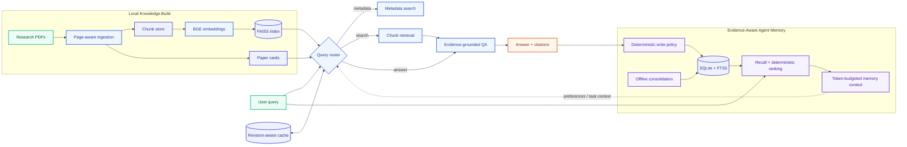

<div align="center">

# LabMate

### Local-first Paper RAG with Evidence-Aware Agent Memory

Turn a folder of research papers into a searchable knowledge workspace, ask grounded questions with page-level
citations, and carry useful context across sessions without treating memory as evidence.

[](https://www.python.org/)
[](https://github.com/facebookresearch/faiss)
[](https://www.sqlite.org/fts5.html)
[](paper_rag/tests)
[](LICENSE)

[Quick Start](#quick-start) · [Architecture](#architecture) · [Agent Memory](#agent-memory) ·
[Scale Test](#verified-engineering) · [Documentation](paper_rag/README.md)

</div>

---

## Why LabMate?

Most local RAG demos stop at “embed documents and call an LLM.” LabMate focuses on the engineering details needed
to make a paper assistant reliable and explainable:

- **Evidence stays visible** — answers are generated from retrieved paper chunks with paper, page, and chunk provenance.
- **Memory is not evidence** — recalled preferences and task state can guide interpretation, but cannot be cited as a paper source.
- **Writes are controlled** — a deterministic policy decides when to add, update, archive, or ignore memory.
- **History is preserved** — corrections supersede old records instead of silently overwriting them.
- **Caches stay consistent** — cache keys include paper revisions, session memory revisions, and request fingerprints.
- **Everything is inspectable** — storage, recall scores, consolidation, audit, evaluation, and scale tests have Python APIs and CLIs.

## At a Glance

| Paper RAG | Agent Memory | Engineering & Evaluation |
|---|---|---|
| PDF ingestion and page-aware chunking | `task_state`, `user_fact`, `episode` | Revision-aware query and topic caches |
| BGE embeddings and FAISS retrieval | SQLite source of truth with FTS5 recall | Memory audit and lifecycle diagnostics |
| Metadata cards and filtered paper search | Project/session isolation | Recall@K, MRR, nDCG and stale-error metrics |
| Evidence-grounded QA with citations | Temporal validity and provenance | Deterministic multi-session scale testing |
| Multi-paper comparison and synthesis | Offline deduplication/consolidation | 144 automated regression tests |

## Architecture



The memory context and paper evidence are passed to the answer layer through separate channels. Prompt rules mark
memory as untrusted context and prohibit using it as citation evidence.

## Core RAG Pipeline

1. Recursively scan local PDFs and assign stable paper IDs.
2. Extract text page by page and build overlapping chunks.
3. Encode chunks with a sentence-transformer and build a normalized FAISS index.
4. Generate compact paper cards for metadata filtering and comparison.
5. Route each query to metadata search, vector search, or evidence-grounded QA.
6. Return ranked chunks and citations containing paper, page, and chunk provenance.
7. Reuse exact query/topic results only when paper, request, and memory revisions still match.

The current local workspace was exercised with **81 PDFs**, **5,394 chunks**, 384-dimensional BGE embeddings, and a
FAISS `IndexFlatIP` index. Runtime papers, indexes, models, and API credentials are intentionally excluded from Git.

## Agent Memory

Memory is opt-in and intentionally lightweight. It is embedded into the RAG request lifecycle rather than deployed as
a separate memory platform.

### Memory types

- `task_state` — current selected papers, topic, or deterministic workflow state within a session.
- `user_fact` — stable preferences explicitly requested by the user, with correction history.
- `episode` — an append-only record of a completed, failed, or evidence-insufficient RAG interaction.

### Lifecycle

```text
retrieve → build bounded context → run RAG → observe outcome
        → NOOP / ADD / UPDATE / ARCHIVE → periodically consolidate
```

Key safeguards:

- stable user facts require an explicit remember request;
- conflicting facts require an explicit correction;
- successful research claims require paper-chunk provenance;
- archived and superseded records are excluded from normal recall;
- project-global memory and session memory have explicit visibility rules;
- memory context has a fixed token budget and cannot become paper evidence;
- cache hits do not manufacture new memories;
- forgetting archives records instead of physically deleting audit history.

## Quick Start

### 1. Install

```bash
git clone https://github.com/lijilong666/labmate.git
cd labmate
python -m venv .venv
# Windows: .venv\Scripts\activate
# Linux/macOS: source .venv/bin/activate
pip install -r requirements.txt
```

Configure an OpenAI-compatible endpoint only when using answer or LLM-assisted comparison modes:

```bash
export LABMATE_LLM_API_KEY="your-key"
export LABMATE_LLM_BASE_URL="https://your-endpoint/v1"
export LABMATE_LLM_MODEL="your-model"
```

### 2. Build a local paper workspace

Place PDFs under `data/raw_papers/`, then run:

```bash
python paper_rag/scripts/build_workspace.py --all --skip_existing
```

This runs PDF ingestion, FAISS indexing, paper-card generation, and metadata cleanup. LLM enrichment remains
explicit because it may consume tokens:

```bash
python paper_rag/scripts/build_workspace.py --run_enrich --only_missing
```

### 3. Query with memory

```bash
python paper_rag/scripts/paper_query.py \
  --query "Continue comparing the selected papers and explain their main difference" \
  --mode answer \
  --memory true \
  --project_id demo-project \
  --session_id comparison-001 \
  --memory_top_k 6 \
  --memory_token_budget 800
```

The same entry point supports `metadata`, `search`, `answer`, and rule-based `auto` routing. Memory remains disabled
unless `--memory true` is supplied.

### 4. Inspect memory

```bash
python paper_rag/scripts/memory_cli.py list \
  --project_id demo-project \
  --session_id comparison-001

python paper_rag/scripts/memory_cli.py search "selected papers" \
  --project_id demo-project \
  --session_id comparison-001 \
  --include_global
```

The CLI also supports `show`, `add`, `correct`, `update`, `archive`, and dry-run-first `consolidate` operations.

## Verified Engineering

The repository includes unit, integration, concurrency, lifecycle, cache-isolation, and scale tests.

| Verification | Result |
|---|---:|
| Automated regression suite | **144 passed** |
| Synthetic scale workload | **100 sessions** |
| Stored memory versions | **7,220** |
| Retrieval evaluation cases | **1,000** |
| Recall@6 / MRR / nDCG@6 | **1.0 / 1.0 / 1.0** |
| Cross-session leakage | **0** |
| Stale-memory recall | **0** |
| Exact duplicate episodes consolidated | **300 / 300** |
| Post-consolidation redundancy | **0** |

These figures come from a deterministic **synthetic engineering workload**. They validate storage, isolation,
retrieval, versioning, and consolidation behavior; they do not claim improved answer quality on a real-world QA
benchmark. See the [scale test report](docs/rag_memory_scale_test_report_zh.md) for configuration and limitations.

Run the test suite:

```bash
pip install pytest
python -m pytest -q
```

Run a disposable scale test:

```bash
python paper_rag/scripts/memory_scale_test.py \
  --sessions 100 \
  --facts_per_session 50 \
  --episodes_per_session 15 \
  --duplicate_pairs_per_session 3 \
  --global_facts 100 \
  --queries 1000
```

## Observability and Evaluation

Every `paper_query` response reports total and per-stage latency for memory preparation, cache lookup, RAG execution,
memory writes, and cache writes. Offline tools provide:

```bash
# Lifecycle, provenance, conflict, and redundancy audit
python paper_rag/scripts/memory_eval.py audit --project_id demo-project

# Recall@K, Precision@K, MRR, nDCG, and stale-memory metrics
python paper_rag/scripts/memory_eval.py retrieval --benchmark memory_benchmark.jsonl

# Paired memory-off vs. memory-on result comparison
python paper_rag/scripts/memory_eval.py compare \
  --baseline results_memory_off.jsonl \
  --candidate results_memory_on.jsonl
```

## Project Structure

```text
labmate/
├── paper_rag/
│   ├── scripts/                 # Build, query, memory, evaluation CLIs
│   ├── src/paper_rag/
│   │   ├── memory/              # Store, policy, recall, context, consolidation
│   │   ├── router.py            # Unified memory-aware query entry point
│   │   ├── qa.py                # Evidence-grounded answer generation
│   │   └── query_cache.py       # Revision-aware exact cache
│   └── tests/                   # Unit, integration, concurrency, scale tests
├── docs/
│   └── rag_memory_scale_test_report_zh.md
└── experiment_agent/            # Planned follow-up module
```

## Design Boundaries

- SQLite is the memory source of truth; FTS5 is a dependency-free lexical baseline.
- FAISS stores paper embeddings, not duplicated copies of paper chunks inside memory.
- LLMs generate answers but do not directly mutate persistent memory.
- Deterministic application code validates every memory operation.
- Runtime PDFs, chunks, indexes, model files, caches, `.env`, and API keys are not committed.
- Real-answer quality improvement is not claimed without a labeled QA benchmark.

## Roadmap

The current project focus is **Paper RAG + Agent Memory**. A future `experiment_agent` may reuse the stable Python
APIs to track experiment runs, configs, results, and reports, but it is intentionally presented as follow-up work
rather than a completed capability.

## Documentation

- [Complete Paper RAG usage and CLI reference](paper_rag/README.md)
- [Memory scale test report](docs/rag_memory_scale_test_report_zh.md)
- [Architecture notes](docs/architecture.md)
- [Roadmap](docs/roadmap.md)

## License

[MIT](LICENSE) © 2026 李纪龙
