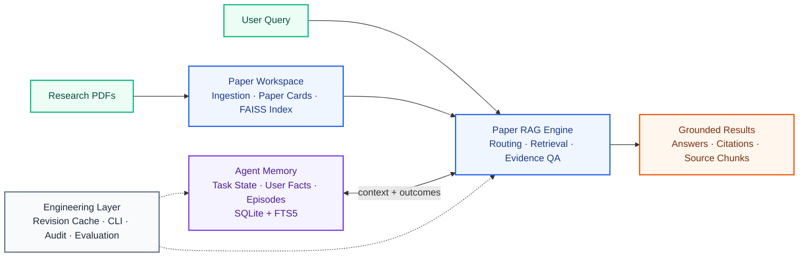

# LabMate Simple Framework

A concise module-level view of the Paper RAG and Agent Memory system.

```mermaid
flowchart LR
    PAPERS[Research PDFs] --> WORKSPACE["Paper Workspace<br/>Ingestion · Paper Cards · FAISS Index"]
    QUERY[User Query] --> RAG["Paper RAG Engine<br/>Routing · Retrieval · Evidence QA"]
    WORKSPACE --> RAG
    MEMORY["Agent Memory<br/>Task State · User Facts · Episodes<br/>SQLite + FTS5"] <-->|context + outcomes| RAG
    RAG --> RESULT["Grounded Results<br/>Answers · Citations · Source Chunks"]
    TOOLS["Engineering Layer<br/>Revision Cache · CLI · Audit · Evaluation"] -.-> RAG
    TOOLS -.-> MEMORY

    classDef input fill:#ECFDF5,stroke:#10B981,color:#064E3B,stroke-width:2px
    classDef rag fill:#EFF6FF,stroke:#2563EB,color:#1E3A8A,stroke-width:2px
    classDef memory fill:#F5F3FF,stroke:#7C3AED,color:#4C1D95,stroke-width:2px
    classDef tools fill:#F8FAFC,stroke:#64748B,color:#1E293B,stroke-width:2px
    classDef output fill:#FFF7ED,stroke:#EA580C,color:#7C2D12,stroke-width:2px

    class PAPERS,QUERY input
    class WORKSPACE,RAG rag
    class MEMORY memory
    class TOOLS tools
    class RESULT output
```
